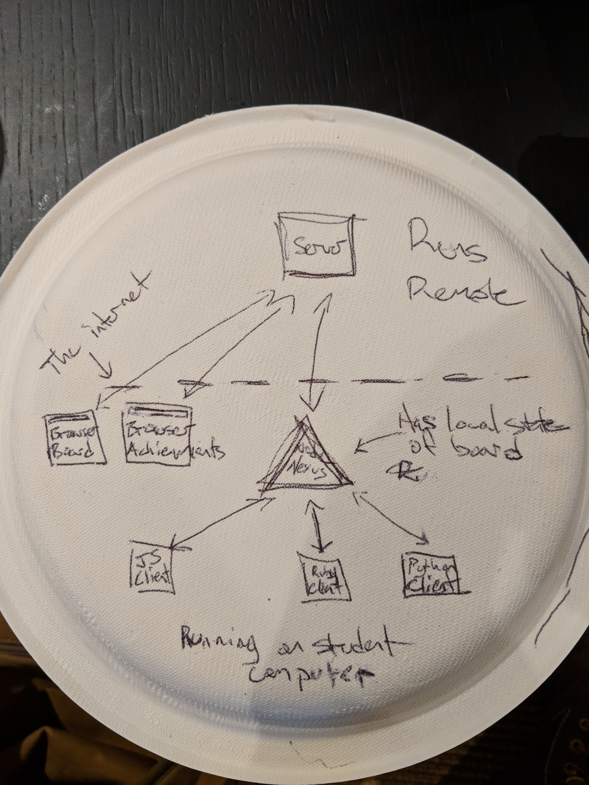

## Apps

There are 5 discrete apps (+ bot scripts) that make up the entire experience.
They stand alone and, assuming standard I/O for testing, and should be able to
operate independently.

TODO finish updating this

Here is a crude drawing on the back of a paper plate:

<a align="center">
  
</a>


#### Browser Achievements/Leaderboard Client

React client for the users. Displays:
  - Locked + unlocked achievements (group specific)
  - Global "first only" achievements
  - Real time leaderboard


#### Browser Statistics Client

React client. Displays:
  - ongoing application statistics (board writes, open ws connections, etc.)
  - (possibly just admin access aka not available to students - instead display it on one screen at each location)


#### Browser Board Client

React client for the users. Displays:
  - The actual board in real time
  - A simple color picker and click handler to change a tiles color
  - using canvas because divs won't be reasonable at the new scale


#### User Clients

<!-- TODO: update this discuss with master steven -->

Node client. Responsible for:
  - connecting to server's ws
  - spinning up in-memory store for board
  - fetching current board state on init
  - handling ws pushes from server tile updates and updating local store
  - wrapping http requests to server (i.e. setting tiles) in an api
  - providing 'first line of hackathon me please defense' via rate limiting
  - providing instructions and plug and play environment for interacting with the experience (ruby for mods 1/2, js for 3/4/5, python for data science)

We are storing and updating a copy of the board state on individual users'
machines to reduce calls to the server. Users may want to perform board
request-intensive operations to decide which tiles to write, i.e.:

```js
boardTiles.forEach(tile => {
  if (tile.color === 'red') {
    // assuming `setTile` posts to server
    setTile({x: tile.x, y: tile.y, color: 'blue'})
  }
})
```

If they didn't have a local copy of the board, the iteration would have to make
a request to the server for every tile (if we were doing a 500 x 500 board
that's a casual 250,000 requests).

With the goal of the project being to foster programmatic user interaction, this
helps us reduce the barriers by providing lower read latency, no need to deal with async responses, and not blowing up
the server.

#### Server

The new server will (hopefully) be an Elixir Plug application. The previous
server was written for Node. Ideally, we would re-appropriate it for testing so
the clients can get on with development while the Elixir server is underway. The
server is where the sausage is made and is responsible for:

- maintaining the 'source of truth' in all things (board, achievements, etc.)
- handling writes to the board via http posts
- handling requests for the whole board via http gets
- maintaining a record of all board I/O to clients
- running the websocket servers and integrating them into the rest of the server:

  ###### Board WS:
  - emit board updates to the connected clients
  - send the initial state of the board when clients connect

  ###### Achievements/Leaderboard WS:
  - emit group specific achievement updates

  ###### Statistics WS:
  - emit overall + group statistics updates (tiles written, open connections, bad requests, etc.)


#### Bots

Simple scripts that will act as clients (perhaps with special permissioning/rate
limiting) an automate some action on the board. This is where the meatbag v.
machine comes into play.
